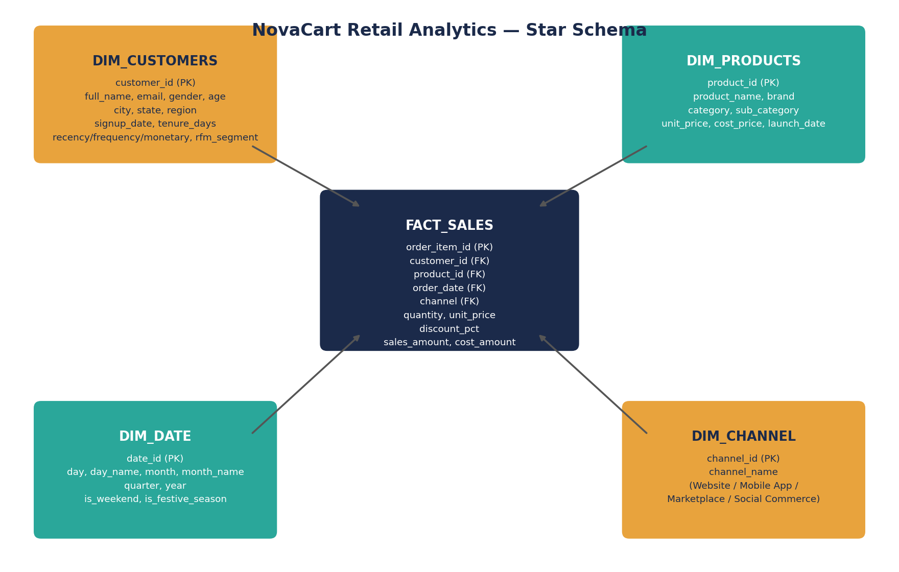

# NovaCart — Power BI Build Guide

Power BI Desktop is a Windows application, so it can't be run inside this
project's automated pipeline — the steps below are written so you can build
the actual `.pbix` report yourself in Power BI Desktop in about 20–30 minutes,
using the data model this project already generated for you.

## 1. Import the data

**Option A — Excel workbook (recommended, one click):**
`Get Data > Excel Workbook` → select `data/powerbi_data_model.xlsx` → tick
all five table sheets (`dim_customers`, `dim_products`, `dim_date`,
`dim_channel`, `fact_sales`) → **Load**.

**Option B — plain CSVs:** `Get Data > Text/CSV`, one file at a time, from
`data/csv_for_powerbi/`.

**Option C — live SQLite:** install the SQLite ODBC driver, then
`Get Data > ODBC` pointing at `data/retail_ecommerce.db`, if you'd rather
connect live instead of importing a snapshot.

## 2. Build the relationships

In **Model view**, drag to create these relationships (all one-to-many,
single direction, dimension → fact):

| From | To | Cardinality |
|---|---|---|
| dim_customers[customer_id] | fact_sales[customer_id] | 1 → * |
| dim_products[product_id] | fact_sales[product_id] | 1 → * |
| dim_date[date_id] | fact_sales[order_date] | 1 → * |
| dim_channel[channel_name] | fact_sales[channel] | 1 → * |

Right-click **dim_date** → **Mark as date table** → pick `date_id`. This
unlocks `SAMEPERIODLASTYEAR`, `DATEADD`, `TOTALYTD`, etc.

## 3. Add the DAX measures

Copy every measure from `DAX_Measures.txt` into a new measure table (create
one blank table called `_Measures` via `Enter Data` so they're not buried
under fact_sales — good modelling hygiene for a portfolio piece).

## 4. Report pages

Build four pages, each a distinct analytical story rather than a random
grid of visuals:

1. **Executive Overview** — KPI cards (Total Revenue, Total Profit, Profit
   Margin %, Total Orders, AOV) across the top; monthly revenue line chart
   with a YoY comparison line; channel donut; region map or filled map.
2. **Sales & Product Performance** — Top-10 products bar chart, category
   treemap sized by revenue and colored by margin %, return-rate table by
   category, quarterly AOV trend.
3. **Customer & RFM Insights** — RFM segment bar/scatter (recency vs
   frequency, bubble size = monetary, colored by segment), repeat-purchase
   KPI, new-vs-returning customers over time, age/gender breakdown.
4. **Cohort Retention** — matrix visual: rows = signup cohort month,
   columns = months since first purchase, values = retained customers or
   retention % with conditional-formatting color scale (this reproduces the
   `06_cohort_retention_heatmap.png` chart natively inside Power BI).

Use **slicers** for date range, region, and channel synced across all four
pages (Format > Edit interactions / Sync slicers pane).

## 5. Adding motion & animation in Power BI

Power BI is not a web canvas — it won't do CSS-style easing or spring
physics — but there are several genuine, native ways to make the report feel
alive and guided rather than static. Used deliberately (not on every visual),
these read as "polished BI report," not gimmicky:

- **Play Axis (real frame-by-frame animation).** On a scatter/bubble chart
  (e.g. Recency vs Frequency, bubble = Monetary), drag `dim_date[month_name]`
  or `dim_date[year]` into the **Play Axis** field well. Power BI will
  animate the bubbles moving month-by-month when you hit play — this is the
  closest native equivalent to a Gapminder-style animated chart, and it's a
  real, well-supported feature (not a workaround).
- **Bookmarks + Buttons for animated state changes.** Create 2–3 bookmarks
  that show/hide different visual states (e.g. "Revenue view" ↔ "Profit
  view" on the Executive Overview page), then wire buttons to them via
  Actions. Pair with the **Button hover/press state** feature (Format >
  Button > icon changes color/shape on hover) — this is a native, animated
  micro-interaction Power BI genuinely supports.
- **Animated tooltip pages.** Build a custom tooltip page (a small report
  page set as a visual's tooltip) — Power BI natively fades these in on
  hover, giving every chart a lightweight reveal animation for free.
- **Data bars & gradient conditional formatting** in your matrix/table
  visuals (e.g. the cohort retention matrix) create a "living heatmap" feel
  without any custom code.
- **AppSource custom visuals**, if you want to go further: "Animated Bar
  Chart Race" and "Infographic Designer" are community visuals that add
  genuine motion (bars racing over time, animated icon fills). Add via
  **Insert > Get more visuals**; vet any third-party visual before using it
  in a client-facing report.
- Keep page transitions themselves simple — Power BI doesn't support a
  cross-fade between pages natively, so don't fight the tool there. Spend
  the "motion budget" on the Play Axis and bookmark-driven interactions
  above, where it's native and reliable.

## 6. Publish

`Home > Publish > Publish to Power BI` (needs a Power BI account/workspace).
For a portfolio piece, exporting to PDF (`File > Export > Export to PDF`)
or recording a 30–60 second screen capture of the Play Axis / bookmark
interactions is usually more useful than a live link, since most reviewers
won't have a Power BI license to open a shared report.

## Why this project also ships an HTML dashboard

Power BI's animation model is native-and-real but intentionally
restrained — Microsoft optimizes it for trustworthy business reporting, not
motion design. Since the brief also asked for a dashboard with richer,
web-native animation (count-up KPIs, animated chart draw-in, a live order
ticker), `dashboard/novacart_dashboard.html` in this project covers that
half of the brief directly in the browser, built from the same underlying
data. Treat the two as companions: Power BI for governed, shareable BI
reporting; the HTML dashboard as the animated showcase piece.
